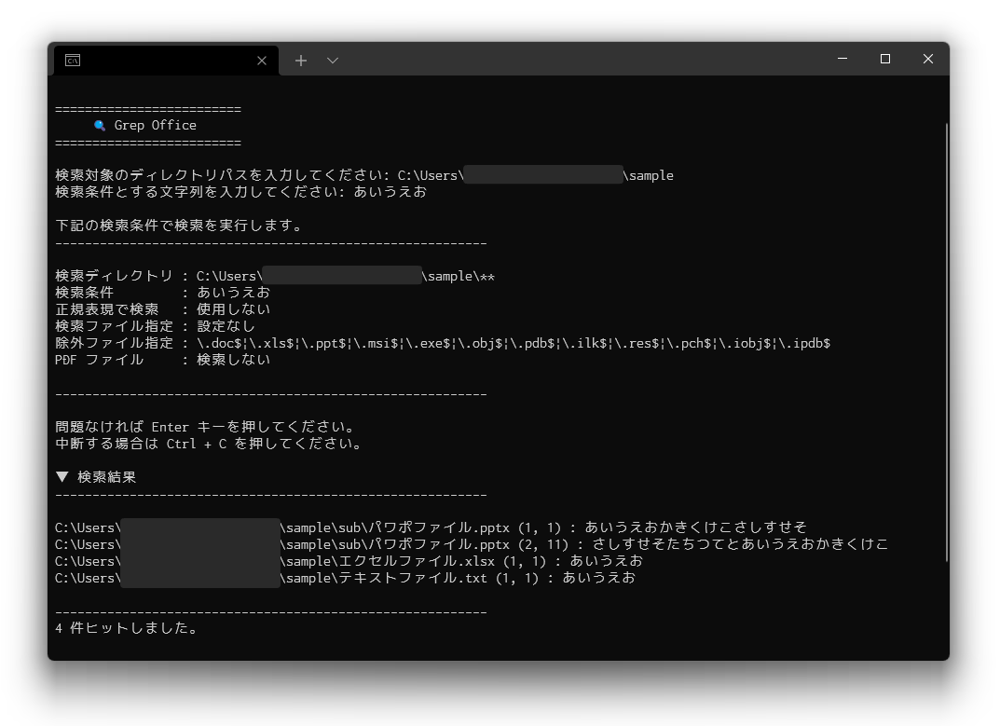

# 1. Grep Office



指定ディレクトリの配下に存在するファイルをもとに、指定された文字列で Grep 検索するツールです。  
Office 系ファイル（.xlsx, .pptx）の検索にも対応しているのが特徴です。

## 1.1. 対応ファイル

### 1.1.1. 対応済みのファイル

- プレーンテキストファイル（UTF-8 のみ）
- Excel ファイル（.xlsx のみ）※ セルに直接記述されたテキストのみが取得できます。関数の出力結果やシェイプ中の文字は取得できません。
- Power Point ファイル（.pptx のみ）

### 1.1.2. 対応予定のファイル

- プレーンテキストファイル（Shift-JIS などの文字コードのファイル）
- Word ファイル（.docx のみ）

### 1.1.3. 未対応のファイル

- 拡張子に x が付かない Office 系ファイル（.xls, .ppt, .doc）
  - 検索の際に利用している xml ファイルの仕様が違うらしいため。
- 隠しファイルや隠しディレクトリ配下の検索
  - モジュールのオプション指定で対応できそうですが不要な気がするので現在は未対応。今後対応させるかも。

## 1.2. 動作環境

Python 3.5 以上。  
Windows、WSL2（Ubuntu）環境で動作確認済みです。

## 1.3. 環境構築

Python をインストール済みの
`Code > Download ZIP` からダウンロードして、好みのディレクトリに展開してください。  
もう少し詳しく準備予定。  

## 1.4. 使い方

### 1.4.1. Windows 環境の場合

Windows 環境の場合は bat ファイルを実行してください。

1. 展開したディレクトリ配下の `Run-GrepOffice.bat` を起動する。
   1. 初回起動時のみ警告が出ると思いますので許可してください。
2. 画面の指示に従って、検索対象のディレクトリパスと検索条件の文字列を入力して送信する。
3. 検索条件の一覧を確認したら `Enter` キーを押して検索を開始。
4. 検索結果が下記のイメージで表示されます。

    ```text
    ▼ 検索結果
    ----------------------------------------------------------

    C:\Users\aaa\bbb\エクセルファイル.xlsx (3, 1) : さしすせそ
    C:\Users\aaa\bbb\テキストファイル.txt (3, 1) : さしすせそ
    C:\Users\aaa\bbb\パワポファイル.pptx (2, 1) : さしすせそたちつてとあいうえお

    ----------------------------------------------------------
    3 件ヒットしました。

    Grep Office を終了します。
    ```

5. 画面の指示に従って終了してください。

基本的な使い方は以上です。  
展開したディレクトリを PowerShell や CMD で開き、`python3 GrepOffice.py` を実行しても OK です。

### 1.4.2. WSL2・MacOS 環境の場合

展開したディレクトリをターミナルで開き、`python3 GrepOffice.py` を実行してください。

## 1.5. 補足や便利な使い方

### 1.5.1. 行・文字番号の見方

検索結果に表示される `(X, Y)` は、そのファイルの中でマッチした行（もしくはスライド）と文字の位置を表しています。  
確認する際の目安にお使いください。

- プレーンテキストの場合
  - X: ○行目
  - Y: ○文字目
- Excel ファイルの場合
  - X: エクセル内に存在するすべての文字情報を順に並べた状態での○行目（要改善……。）
  - Y: ○文字目
- Power Point ファイルの場合
  - X: ○スライド目
  - Y: ○文字目

### 1.5.2. 検索ファイル・除外ファイルの設定

展開したディレクトリ直下に存在する `setup.py` を編集することで、検索するファイルを絞り込んだり検索から除外するファイルを指定できたりします。  
詳しくは `setup.py` のコメントを参照してください。

### 1.5.3. bat ファイルのショートカット作成

bat ファイルはショートカットからの実行も可能です。  
ショートカットを作成して、デスクトップなど好きな場所に配置すると簡単に実行できて便利です。

## 1.6. 注意点

### 1.6.1. 検索するディレクトリはなるべく深めに設定する

このツールは、指定ディレクトリ配下に存在する展開可能なファイルを順番に開いて検索するという処理を繰り返す仕様です。

ファイルサイズやファイル数指定などでの制限は現行だと特に設けていないため、  
**指定した階層が浅すぎると PC や検索先のサーバー等に負荷をかけてしまう可能性があります。**

そのため、検索対象にするディレクトリはなるべく深い階層を指定するようにしてください。

## 1.7. ライセンス

このアプリケーションは MIT ライセンスの下でリリースされています。  
[ライセンス全文はこちら](#)
